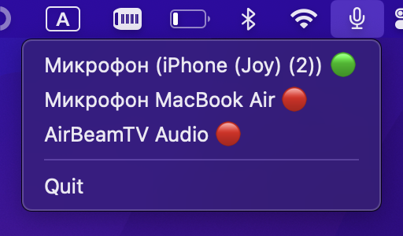

# Simple microphone switcher for MacOS

## Problem❓
Often, the microphones of plug-in headphones (earpods, airpods) are of worse quality than the built-in microphone in your MacBook. To switch it, you need to go to settings -> sound -> input -> look for the device...
It's long and inconvenient to do this every time you plug in a headset. 

## Solved ✅
This program adds a small menu to the status bar for convenient and fast switching between input devices

## Tested
Tested on MacOS 13.2 (Air, M1)